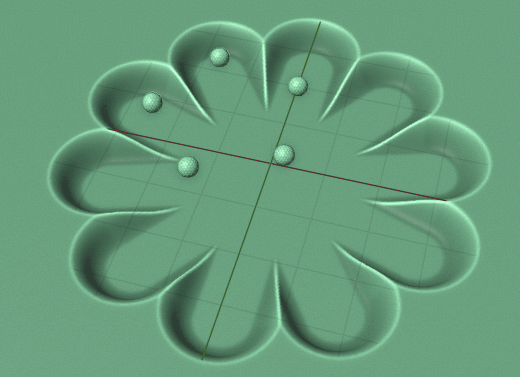

# pynodes

[](LICENSE)
[](https://www.python.org/downloads/release/python-310/)
[](http://www.maxon.net)

Programmatical nodes for blender including geometry nodes, shader nodes, compositor nodes, light nodes, world nodes etc.

## Documentation

https://iplai.github.io/pynodes/

## A Quick Example

```python
from pynodes import *


@tree
def tulsi_couple(count: Integer = (5, 1, 8)):

    line = CurveLine((0, -3, 0), (0, 3, 0))

    points = InputPoints(count=count)

    with frame("Clone and rotate Lines"):

        lines = line.on_points(points, rotation=(points.index * pi / count).to_euler()).realize_instances()

    with frame("Distances from grid points to lines"):

        distance = lines.to_mesh().proximity("EDGES").distance

    with frame("Set grid position by distance"):

        plane = MeshGrid(20, 20, 200, 200).mesh

        plane[distance < 1].set_position(offset=-plane.nornal * (1 - distance).float_curve(points=[(0, 0), (0.05, 0.03), (0.5, 0.5, "auto_clamped"), (1, 0.5)]))

        plane.set_shade_smooth()

    with frame("Clone and animate Spheres"):

        sphere = MeshIcoSphere(radius=0.2, subdivisions=3).mesh

        t = Float.sin(SceneTime().seconds * 4 + (lines.index / count) * pi).map_range(-1, 1, 0, 1)

        spheres = sphere.on_points(lines.trim_factor(start=t)[lines.endpoint_selection(start_size=1, end_size=0)])

    return plane + spheres
```

