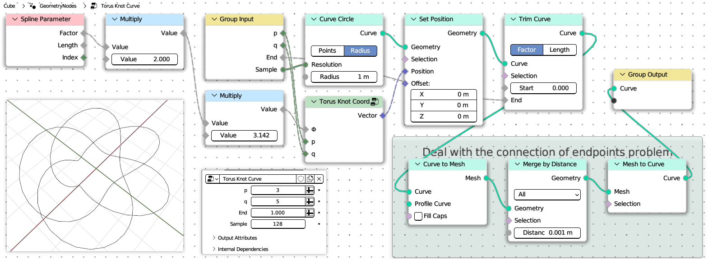
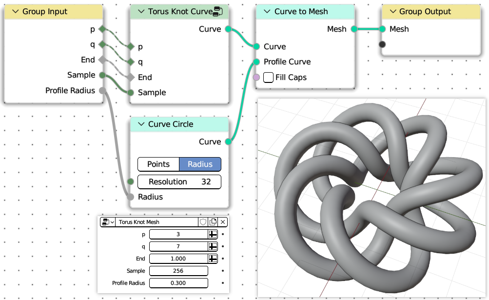
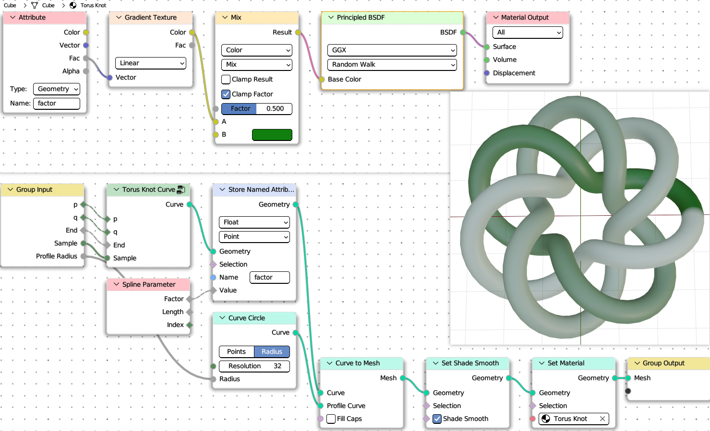

# pynodes

[](LICENSE)
[](https://www.python.org/downloads/release/python-310/)
[](http://www.blender.org)

#### *Programmatical nodes for blender including geometry nodes, shader nodes, compositor nodes, light nodes, world nodes etc.*

Pynodes is ia a module as well as an addon for blender to create all kinds of nodes in node editor with python sciprts.
Decorate a python function to represent a blender node group for any kind of tree in blender node editor.

## Documentation

https://iplai.github.io/pynodes/

## About the birth of this module

Although this module is derived from [`geonodes`](https://github.com/al1brn/geonodes), But the implementation logic and usage are completely different.

For [`geonodes`](https://github.com/al1brn/geonodes), only geometry nodes are supported, while `pynodes` supports almost all of blender's node trees, including geometry nodes and material nodes.

## Prerequisities

Before using pynodes, you must first know:

- How to use `Blender` Node editor

- `Python` language

- How to run `Python` script in `Blender`

## Bacis Concepts

Nodes are created by a series of chain calls in a python function decrorated by [`pynodes.core.tree`](https://iplai.github.io/pynodes/apidocs/pynodes/pynodes.core.html#pynodes.core.tree "pynodes.core.tree") which represents a node group in blender.

- Operations on nodes are based on the output port(data socket), not on the node itself.

- A decorated `Python` function (`@tree`) corresponds to a tree of nodes. Calling the function means creating a group node in the current node tree.

- Data in a data flow has strict type checking, what methods are available for the data socket, and what is provided by its type.

- Good IDE support，e.g. [`VS Code`](https://code.visualstudio.com/). All exposed methods have built-in documentation, including images of the nodes involved, optional enumeration parameters, and links to official documentation.

## Install Addon

- Download the latest released zip file from [github](https://github.com/iplai/pynodes/releases).

- Install the addon in blender

    
    

When the addon installed, enable it. (check the box of `Node: PyNodes`). Then the module `pynodes` is in your python path of blender, and the UI will appear in the Sidebar of Node Editor of Blender. The nodes in node editor can be arranged in real time with the parameters in UI.


## Setup VSCode

It is recommanded to use vscode to write python scripts for blender. Here are tutorials to setup vscode for blender python.

> 5 Steps to setup VSCode for Blender Python by CG Python (on [Windows](https://www.youtube.com/watch?v=YUytEtaVrrc) [Mac](https://www.youtube.com/watch?v=_0srGXAzBZE) [Linux](https://www.youtube.com/watch?v=zP0s1i9EXeM))

## A Quick Example

> Target: Make a parametric Torus Knot

The (p,q)-torus knot winds q times around a circle in the interior of the torus, and p times around its axis of rotational symmetry. If p and q are not relatively prime, then we have a torus link with more than one component.


### Parametric Equation

The (p,q)-torus knot can be given by the parametrization:

$$
\begin{array}{l}
r=\cos (q \phi)+2,\ \ 0<\phi<2 \pi\\
x=r \cos (p \phi) \\
y=r \sin (p \phi) \\
z=-\sin (q \phi)
\end{array}
$$

### The First Node Tree

Define a node tree corresponding the parametric equation above:


```python
from pynodes import *
from pynodes.math import *

@tree
def torus_knot_coord(Φ: Float, p: Integer, q: Integer):
    # The name of the function decorated by the decorator is treated as the name of the node tree

    r = cos(q * Φ) + 2

    x = r * cos(p * Φ)

    y = r * sin(p * Φ)

    z = -sin(q * Φ)

    return CombineXYZ(x, y, z)
```

The tree name will be converted from underscore to camel case. Which means `torus_knot_coord` is converted to `Torus Knot Coord`. If the decorated function has `__docstring__`, then use it instead. More details see: [`pynodes.core.tree`](https://iplai.github.io/pynodes/apidocs/pynodes/pynodes.core.html#pynodes.core.tree)

Type hinting in function signatures cannot be omitted. For normal python programs, type hints are dispensable, just like comments, and do not affect program execution. But in `pynodes`, the program relies on type hinting to work.

All valid types are subclasses of [`pynodes.core.Socket`](https://iplai.github.io/pynodes/apidocs/pynodes/pynodes.core.html#pynodes.core.Socket).

See [Available Socket Types](https://iplai.github.io/pynodes/socket_types.html)

### The Second Node Tree

Make a curve circle, set the position of the curve by calling the function above.



```python
@tree
def torus_knot_curve(
    p: Integer = 2,
    q: Integer = 3,
    # End factor for trim curve (name, default, min, max)
    e: Float = ("End", 1, 0, 1),
    # The larger the value, the smoother the curve (name, default))
    n: Integer = ("Sample", 128)
):
    # Create a primitive curve circle node and assign the geometry of the output socket to `curve`
    curve = CurveCircle(resolution=n)

    # Call the node tree defined above as a function
    pos = torus_knot_coord(curve.parameter.factor * 2 * pi, p, q)

    # Use the obtained coordinates to set the position of the curve,
    # and then create a trim curve node to trim the curve by the end factor.
    curve = curve.set_position(position=pos).trim_factor(end=e)

    # Create a frame, pass in the label of the frame.
    with frame("Deal with the connection of endpoints problem"):
        # All nodes created in the scope of the with statement will embeded in this frame
        curve = curve.to_mesh().merge_by_distance().to_curve()
        # The above operation is actually to align the normal lines
        # at the beginning and end of the curve, so that when the mesh
        # surface is generated later, it will not break

    return curve
```

**About the Default value of parameter**

After being decorated by the decorator, the parameters of the function represent the group input. You can set a default value for the group input. By default, the name of the group input is the parameter name, or you can set it to a tuple, in which the elements represent: `name`, `default`, `minimum`, and `maximum`

**About the internal implementation logic**

The function decorated by the decorator [`pynodes.core.tree`](https://iplai.github.io/pynodes/apidocs/pynodes/pynodes.core.html#pynodes.core.tree), whether it is defined, or called, the parameters passed to it will not really be executed inside the function body, this point for python beginners, may be very confusing, but you only need to know that in the specific implementation of the decorator, with a set of methods(steal the beams and pillars and replace them rotten timber-perpetrate a fraud).

### The Third Node Tree

Then sweep the curve to mesh with a profile curve.



```python
@tree
def torus_knot_mesh(
    p: Integer = 3,
    q: Integer = 7,
    e: Float = ("End", 1, 0, 1),
    n: Integer = ("Sample", 256),
    # The radius of the profile curve circle
    r: Float = ("Profile Radius", 0.3)
):
    # Call the node tree defined above
    curve = torus_knot_curve(p, q, e, n)

    # Sweep the curve to mesh with a profile curve
    mesh = curve.to_mesh(CurveCircle(radius=r))

    return mesh
```

As you can see from the above example, the creation of a node can be achieved by a set of chain calls, which methods can be called depending on the data type of the port, and the advantage of strict type checking is that you can let the IDE automatically indicate which methods the current object has.

At this point, the Geometry node tree is created, and then you just need to add the geometry node modifier to an object in Blender, set the node tree to Torus Knot Mesh, and you will get the result effect!

### Version with material

Not only geometry nodes, material nodes are also supported. Modify the third function, and add a material function.
=


```python
@tree
def torus_knot_mesh(
    p: Integer = 3,
    q: Integer = 7,
    e: Float = ("End", 1, 0, 1),
    n: Integer = ("Sample", 256),
    # The radius of the profile curve circle
    r: Float = ("Profile Radius", 0.3)
):
    # Call the node tree defined above
    curve = torus_knot_curve(p, q, e, n)

    # Store the parameter factor of the curve for shading
    curve.store_named_attribute("factor", curve.parameter.factor)

    # Sweep the curve to mesh with a profile curve
    mesh = curve.to_mesh(CurveCircle(radius=r))
    # return mesh

    # Optional: set the shade smooth and set the material
    return mesh.set_shade_smooth().set_material("Torus Knot")


@tree
def torus_knot():
    """@Material"""

    shader = BSDF.Principled()

    factor = Shader.attribute(name="factor").fac

    color = GradientTexture(vector=factor).color

    color = color.mix("#117f0f")

    shader['Base Color'] = color

    return shader
```

When the `__docstring__` starts with `@Material` (case insensitive), then the tree represents a material node tree. More details see: [`pynodes.core.tree`](https://iplai.github.io/pynodes/apidocs/pynodes/pynodes.core.html#pynodes.core.tree)

###Scene Management

Besides, Scene management is also possible with pynodes.

```python
from pynodes.scene import *

scene = Tree({
    O.cube: {
        "location": (0, 0, 0),
        Mod.geometry_nodes: {
            "node_group": "Torus Knot Mesh",
            "End": [(1, 0.0), (230, 1.0)], # Set keyframe for frame 1 and frame 230
        },
    },
}).load()
```

The submodule pynodes.scene is still under construction, very limited features are available at the moment.